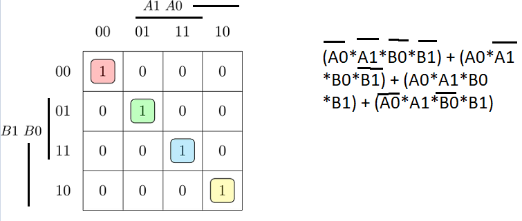
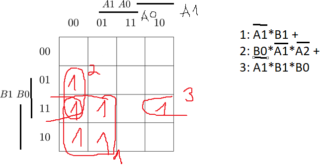
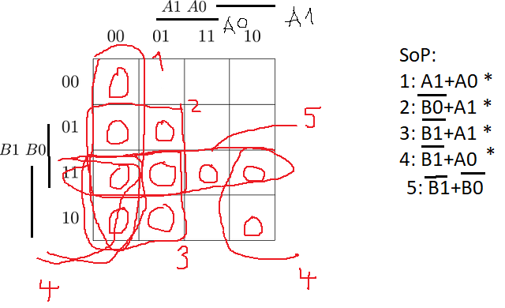
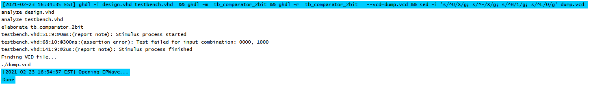

# Home preparetion truth table


# 2 bit comparator

## K-maps with simplified equatations

> Kmap for equals



> Kmap for Sop greather than



> Kmap for less than 



### Plaground URL
https://www.edaplayground.com/x/GCz6

# 4 bit comparator
> design.vhd

```vhdl
entity comparator_2bit is
    port(
        a_i           : in  std_logic_vector(4 - 1 downto 0);
        b_i           : in  std_logic_vector(4 - 1 downto 0);


        -- COMPLETE THE ENTITY DECLARATION


        B_less_A_o    : out std_logic;       -- B is less than A
        B_greater_A_o : out std_logic;
        B_equals_A_o  : out std_logic
    );
end entity comparator_2bit;

------------------------------------------------------------------------
-- Architecture body for 2-bit binary comparator
------------------------------------------------------------------------
architecture Behavioral of comparator_2bit is
begin
    B_less_A_o      <= '1' when (b_i < a_i) else '0';
    B_greater_A_o   <= '1' when (b_i > a_i) else '0';
    B_equals_A_o    <= '1' when (b_i = a_i) else '0';


    -- WRITE "GREATER" AND "EQUALS" ASSIGNMENTS HERE


end architecture Behavioral;
```

>testbench.vhd
```vhdl
-- Architecture body for testbench
------------------------------------------------------------------------
architecture testbench of tb_comparator_2bit is

    -- Local signals
    signal s_a       : std_logic_vector(4 - 1 downto 0);
    signal s_b       : std_logic_vector(4 - 1 downto 0);
    signal s_B_greater_A : std_logic;
    signal s_B_equals_A  : std_logic;
    signal s_B_less_A    : std_logic;

begin
    -- Connecting testbench signals with comparator_2bit entity (Unit Under Test)
    uut_comparator_2bit : entity work.comparator_2bit
        port map(
            a_i           => s_a,
            b_i           => s_b,
            B_greater_A_o => s_B_greater_A,
            B_equals_A_o  => s_B_equals_A,
            B_less_A_o    => s_B_less_A
        );

    --------------------------------------------------------------------
    -- Data generation process
    --------------------------------------------------------------------
    p_stimulus : process
    begin
        -- Report a note at the beginning of stimulus process
        report "Stimulus process started" severity note;


        -- First test values
        s_b <= "0000"; s_a <= "0000"; wait for 100 ns;
        -- Expected output
        assert ((s_B_greater_A = '0') and (s_B_equals_A = '1') and (s_B_less_A = '0'))
        -- If false, then report an error
        report "Test failed for input combination: 00, 00" severity error;
        
        
        -- WRITE OTHER TEST CASES HERE
         s_b <= "0000"; s_a <= "0001"; wait for 100 ns;
         assert ((s_B_greater_A = '0') and (s_B_equals_A = '0') and (s_B_less_A = '1'))
         report "Test failed for input combination: 00, 00" severity error;
         
         s_b <= "0000"; s_a <= "1000"; wait for 100 ns;
         assert ((s_B_greater_A = '0') and (s_B_equals_A = '1') and (s_B_less_A = '0')) --This one is false
         report "Test failed for input combination: 0000, 1000" severity error;
         
         s_b <= "0000"; s_a <= "1100"; wait for 100 ns;
         assert ((s_B_greater_A = '0') and (s_B_equals_A = '0') and (s_B_less_A = '1'))
         report "Test failed for input combination: 00, 00" severity error;
         
         s_b <= "0001"; s_a <= "0000"; wait for 100 ns;
         assert ((s_B_greater_A = '1') and (s_B_equals_A = '0') and (s_B_less_A = '0'))
         report "Test failed for input combination: 00, 00" severity error;
         
         s_b <= "1000"; s_a <= "0000"; wait for 100 ns;
         assert ((s_B_greater_A = '1') and (s_B_equals_A = '0') and (s_B_less_A = '0'))
         report "Test failed for input combination: 00, 00" severity error;
         
         s_b <= "1100"; s_a <= "0000"; wait for 100 ns;
         assert ((s_B_greater_A = '1') and (s_B_equals_A = '0') and (s_B_less_A = '0'))
         report "Test failed for input combination: 00, 00" severity error;
         
         s_b <= "0001"; s_a <= "0001"; wait for 100 ns;
         assert ((s_B_greater_A = '0') and (s_B_equals_A = '1') and (s_B_less_A = '0'))
         report "Test failed for input combination: 00, 00" severity error;
         
         s_b <= "1000"; s_a <= "1000"; wait for 100 ns;
         assert ((s_B_greater_A = '0') and (s_B_equals_A = '1') and (s_B_less_A = '0'))
         report "Test failed for input combination: 00, 00" severity error;
         
         s_b <= "1100"; s_a <= "1100"; wait for 100 ns;
         assert ((s_B_greater_A = '0') and (s_B_equals_A = '1') and (s_B_less_A = '0'))
         report "Test failed for input combination: 00, 00" severity error;
         
         s_b <= "0001"; s_a <= "1000"; wait for 100 ns;
         assert ((s_B_greater_A = '0') and (s_B_equals_A = '0') and (s_B_less_A = '1'))
         report "Test failed for input combination: 00, 00" severity error;
         
         s_b <= "0001"; s_a <= "1100"; wait for 100 ns;
         assert ((s_B_greater_A = '0') and (s_B_equals_A = '0') and (s_B_less_A = '1'))
         report "Test failed for input combination: 00, 00" severity error;
         
         s_b <= "1100"; s_a <= "0001"; wait for 100 ns;
         assert ((s_B_greater_A = '1') and (s_B_equals_A = '0') and (s_B_less_A = '0'))
         report "Test failed for input combination: 00, 00" severity error;
         
         s_b <= "1000"; s_a <= "1100"; wait for 100 ns;
         assert ((s_B_greater_A = '0') and (s_B_equals_A = '0') and (s_B_less_A = '1'))
         report "Test failed for input combination: 00, 00" severity error;
         
         s_b <= "1100"; s_a <= "1000"; wait for 100 ns;
         assert ((s_B_greater_A = '1') and (s_B_equals_A = '0') and (s_B_less_A = '0'))
         report "Test failed for input combination: 00, 00" severity error;
         
         s_b <= "1000"; s_a <= "0001"; wait for 100 ns;
         assert ((s_B_greater_A = '1') and (s_B_equals_A = '0') and (s_B_less_A = '0'))
         report "Test failed for input combination: 00, 00" severity error;
         
         s_b <= "0100"; s_a <= "0100"; wait for 100 ns;
         assert ((s_B_greater_A = '0') and (s_B_equals_A = '1') and (s_B_less_A = '0'))
         report "Test failed for input combination: 00, 00" severity error;
         
         s_b <= "1111"; s_a <= "1111"; wait for 100 ns;
         assert ((s_B_greater_A = '0') and (s_B_equals_A = '1') and (s_B_less_A = '0'))
         report "Test failed for input combination: 00, 00" severity error;
         
         s_b <= "1001"; s_a <= "1001"; wait for 100 ns;
         assert ((s_B_greater_A = '0') and (s_B_equals_A = '1') and (s_B_less_A = '0'))
         report "Test failed for input combination: 00, 00" severity error;
         
         s_b <= "1011"; s_a <= "1011"; wait for 100 ns;
         assert ((s_B_greater_A = '0') and (s_B_equals_A = '1') and (s_B_less_A = '0'))
         report "Test failed for input combination: 00, 00" severity error;


        -- Report a note at the end of stimulus process
        report "Stimulus process finished" severity note;
        wait;
    end process p_stimulus;

end architecture testbench;
```

### An error


>Playground link
https://www.edaplayground.com/x/E6wz