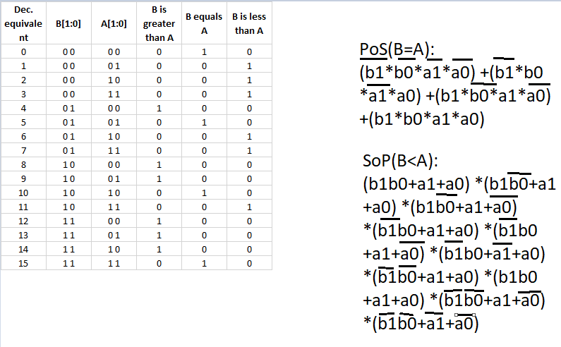

# Home preparetion truth table

# 2 bit comparator

## K-maps with simplified equatations

> Kmap for equals

> Kmap for Sop greather than

> Kmap for less than 

### Plaground URL
https://www.edaplayground.com/x/GCz6