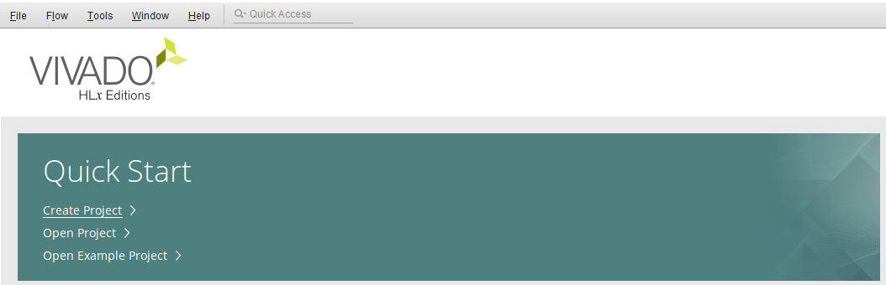
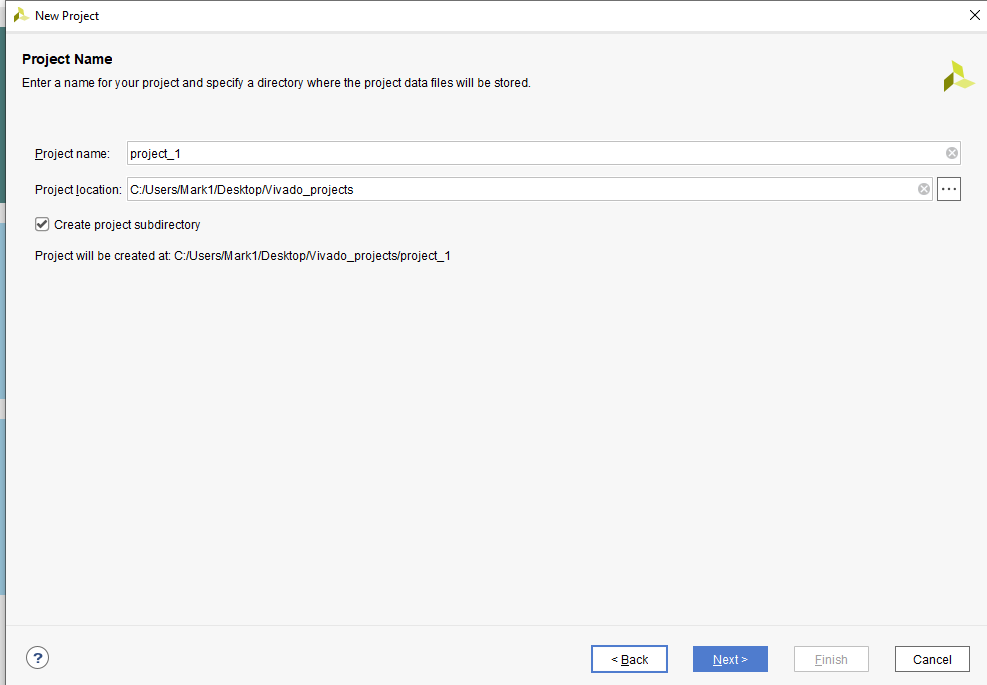
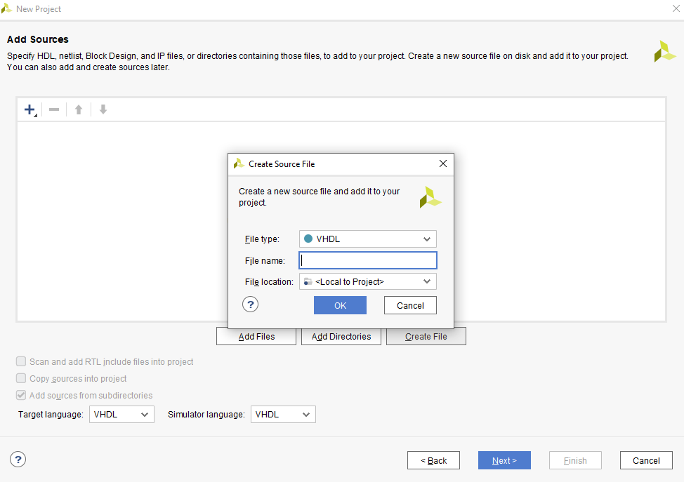
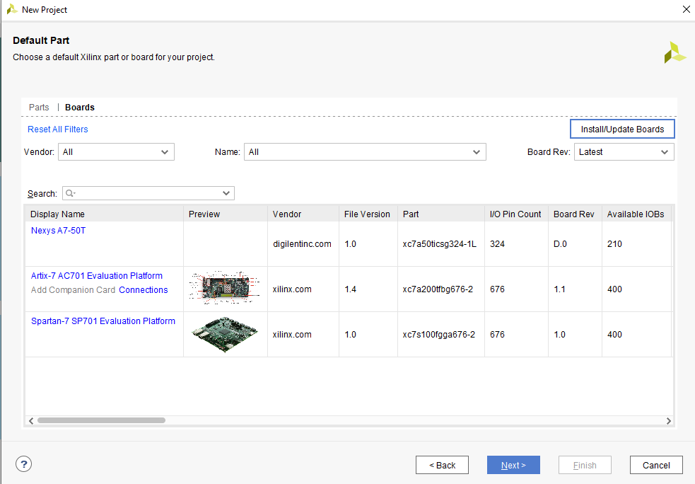
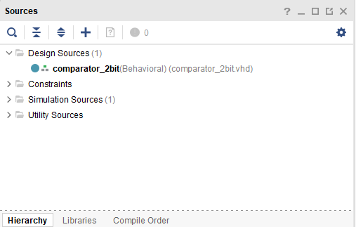
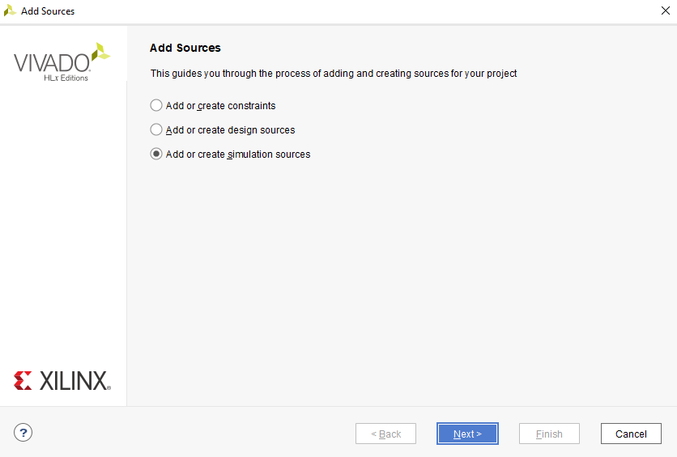
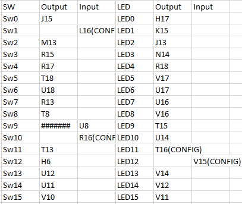
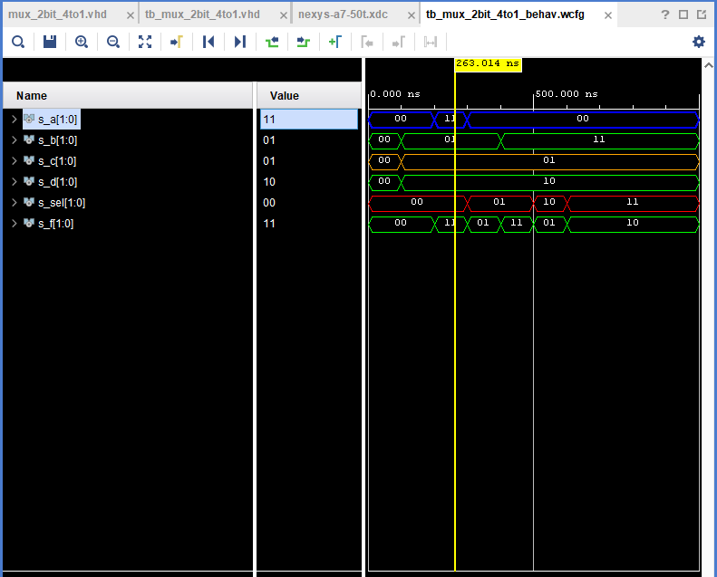

# 1.Vivado tutorial
## Project creation 

1.After launching Vivado executable, we can create a new project by either going through File > Project > New or the same thing can be done through Qucik Start


2.By clicking Next we come to a window, where we select project name and its location, then we select a project type. Most of the time we use RTL Project.


3.We add sources by clicking on Create File. Here we can choose its name and especially the langugage we work in. In our case it is VHDL.


4.Next we choose the Defalut Part. Here we can switch to Boards and select our preferred board or we add a new one by clicking Install/Update Boards. However, we can manually add new board by extracting it to a certain directory.
We accept the changes by pressing the Finish button.


## Adding source file, adding testbench file

1.When we had successfuly created a new project, we can find it in Design Sources > "Its name".


2.When it comes to adding source files, we do that in the upper left corner by pressing File > Add sources > Add/Create simulation/design source. We repeat the same process just like in "Project Creation" step no. 3.


## Running the project

1.We run the project by simply clicking on Flow in the toolmenu, then Run Simulation and finally Run Behavioral Simulation. 

# 2.Preparation task

## Connection of 16 switches and 16 LEDs


# 3. 4-1 multiplex

>mux_2bit_4to1.vhd source file

```vhdl
entity mux_2bit_4to1 is
    port(
        a_i           : in  std_logic_vector(2 - 1 downto 0);
        b_i           : in  std_logic_vector(2 - 1 downto 0);
        c_i           : in  std_logic_vector(2 - 1 downto 0);
        d_i           : in  std_logic_vector(2 - 1 downto 0);
        sel_i         : in  std_logic_vector(2 - 1 downto 0);


        -- COMPLETE THE ENTITY DECLARATION


        f_o    : out std_logic_vector(2 - 1 downto 0)      
       
    );
end entity mux_2bit_4to1;

------------------------------------------------------------------------
-- Architecture body for 2-bit binary comparator
------------------------------------------------------------------------
architecture Behavioral of mux_2bit_4to1 is
begin
    f_o <= a_i when (sel_i = "00") else
           b_i when (sel_i = "01") else
           c_i when (sel_i = "10") else
           d_i;

    -- WRITE "GREATER" AND "EQUALS" ASSIGNMENTS HERE


end architecture Behavioral;
```

>tb_mux_2bit_4to1.vhd testbench file

```vhdl
architecture testbench of tb_mux_2bit_4to1 is

    -- Local signals
    signal s_a       : std_logic_vector(2 - 1 downto 0);
    signal s_b       : std_logic_vector(2 - 1 downto 0);
    signal s_c       : std_logic_vector(2 - 1 downto 0);
    signal s_d       : std_logic_vector(2 - 1 downto 0);
    signal s_sel     : std_logic_vector(2 - 1 downto 0);
    signal s_f       : std_logic_vector(2 - 1 downto 0);

begin
    -- Connecting testbench signals with comparator_2bit entity (Unit Under Test)
    uut_mux_2bit_4to1 : entity work.mux_2bit_4to1
        port map(
            a_i           => s_a,
            b_i           => s_b,
            c_i           => s_c,
            d_i           => s_d,
            sel_i         => s_sel,
            f_o           => s_f
            
        );

    --------------------------------------------------------------------
    -- Data generation process
    --------------------------------------------------------------------
    p_stimulus : process
    begin
        -- Report a note at the beginning of stimulus process
        report "Stimulus process started" severity note;


        -- First test values
        s_d <= "00"; s_c <= "00"; s_b <= "00"; s_a <= "00"; 
        s_sel <= "00"; wait for 100 ns;
        
        s_d <= "10"; s_c <= "01"; s_b <= "01"; s_a <= "00"; 
        s_sel <= "00"; wait for 100 ns;
        
        s_d <= "10"; s_c <= "01"; s_b <= "01"; s_a <= "11"; 
        s_sel <= "00"; wait for 100 ns;
        
        s_d <= "10"; s_c <= "01"; s_b <= "01"; s_a <= "00"; 
        s_sel <= "01"; wait for 100 ns;
        
        s_d <= "10"; s_c <= "01"; s_b <= "11"; s_a <= "00"; 
        s_sel <= "01"; wait for 100 ns;
        
        --s_d <= "10"; s_c <= "01"; s_b <= "11"; s_a <= "00"; 
        s_sel <= "10"; wait for 100 ns;
        
        --s_d <= "10"; s_c <= "01"; s_b <= "11"; s_a <= "00"; 
        s_sel <= "11"; wait for 100 ns;
     
        -- WRITE OTHER TEST CASES HERE
        


        -- Report a note at the end of stimulus process
        report "Stimulus process finished" severity note;
        wait;
    end process p_stimulus;

end architecture testbench;

```

> Simulated weveforms

