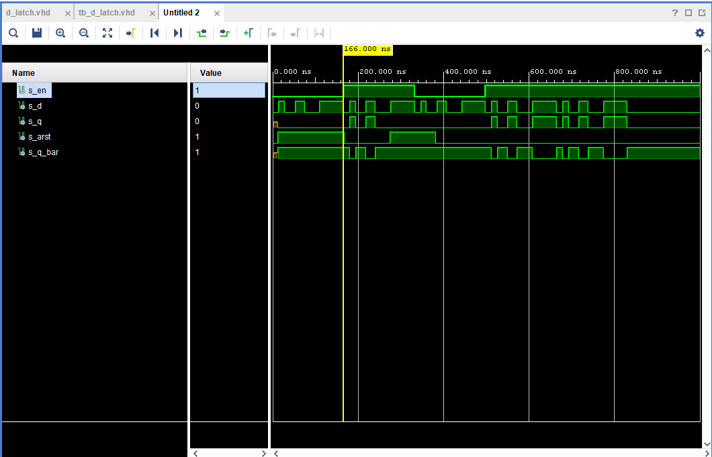
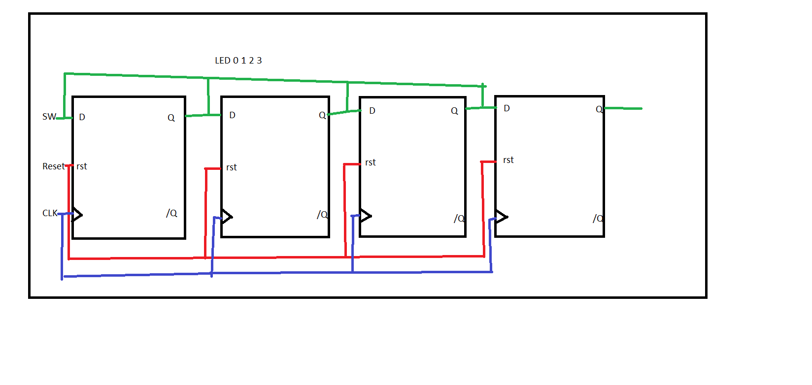

# 1.Preparation task - truth tables for D, JK and T flip-flops
> D flip flop
Q(n+1) = d

| **clk** | **d** | **q(n)** | **q(n+1)** | **Comments** |
   | :-: | :-: | :-: | :-: | :-- |
   |  | 0 | 0 | 0 | No change |
   |  | 0 | 1 | 0 | Invert |
   |  | 1 | 0 | 1 | Invert |
   |  | 1 | 1 | 1 | No change |

> JK flip-flop
Q(n+1) = j * (/Qn) + (/k) * Qn

   | **clk** | **j** | **k** | **q(n)** | **q(n+1)** | **Comments** |
   | :-: | :-: | :-: | :-: | :-: | :-- |
   |  | 0 | 0 | 0 | 0 | No change |
   |  | 0 | 0 | 1 | 1 | No change |
   |  | 0 | 1 | 0 | 0 | Reset |
   |  | 0 | 1 | 1 | 0 | Reset |
   |  | 1 | 0 | 0 | 1 | Set |
   |  | 1 | 0 | 1 | 1 | Set |
   |  | 1 | 1 | 0 | 1 | Toggle |
   |  | 1 | 1 | 1 | 0 | Toggle |

> T flip-flop
Q(n+1) = t * (/Qn) + (/t) * Qn

   | **clk** | **t** | **q(n)** | **q(n+1)** | **Comments** |
   | :-: | :-: | :-: | :-: | :-- |
   |  | 0 | 0 | 0 | No change |
   |  | 0 | 1 | 1 | No change |
   |  | 1 | 0 | 1 | Invert (Toggle) |
   |  | 1 | 1 | 0 | Invert (Toggle) |

# 2. D - latch

## VHDL code of p_d_latch

```vhdl
architecture Behavioral of d_latch is

begin
    p_d_latch : process (en, d , arst)
    begin
        if (arst = '1') then
            q     <= '0';
            q_bar <= '1';
            elsif (en = '1') then
                q     <= d;
                q_bar <= not d;
                
        end if;
    
    end process p_d_latch;

```

## VHDL reset and stimulus from tb_d_latch
```vhdl
 p_reset_gen : process
    begin
        s_arst <= '0';
        wait for 12 ns;
        
        -- Reset activated
        s_arst <= '1';
        wait for 155 ns;
       
        -- Reset deactivated
        s_arst <= '0';
        wait for 108 ns;
        
        -- Reset activated
        s_arst <= '1';
        wait for 106 ns;
       
        s_arst <= '0';
        wait;
    end process p_reset_gen;
   
   
   
    p_stimulus : process
    begin
        -- Report a note at the beginning of stimulus process
        report "Stimulus process started" severity note;

            s_d <= '0';
            s_en <= '0';
            
            assert (s_q = '0')
            report "s_d and s_en = 0" severity error;
            
            wait for 14ns;
            s_d <= '1';
            wait for 14ns;
            s_d <= '0';
            wait for 24ns;
            s_d <= '1';
            wait for 22ns;
            s_d <= '0';
            wait for 36ns;
            s_d <= '1';
            wait for 56ns;
            s_d <= '0';
            
            assert (s_q = '0' and s_q_bar = '1')
            report "s_d = s_q and s_en = s_q_bar" severity error;
            
            s_en <= '1';

             wait for 14ns;
            s_d <= '1';
            wait for 14ns;
            s_d <= '0';
            wait for 24ns;
            s_d <= '1';
            wait for 22ns;
            s_d <= '0';
            wait for 36ns;
            s_d <= '1';
            wait for 56ns;
            s_d <= '0';
            
            s_en <= '0';
                        
             wait for 14ns;
            s_d <= '1';
            wait for 14ns;
            s_d <= '0';
            wait for 24ns;
            s_d <= '1';
            wait for 22ns;
            s_d <= '0';
            wait for 36ns;
            s_d <= '1';
            wait for 56ns;
            s_d <= '0';
            
            s_en <= '1';
            
             wait for 14ns;
            s_d <= '1';
            wait for 14ns;
            s_d <= '0';
            wait for 24ns;
            s_d <= '1';
            wait for 22ns;
            s_d <= '0';
            wait for 36ns;
            s_d <= '1';
            wait for 56ns;
            s_d <= '0';
            
             wait for 14ns;
            s_d <= '1';
            wait for 14ns;
            s_d <= '0';
            wait for 24ns;
            s_d <= '1';
            wait for 22ns;
            s_d <= '0';
            wait for 36ns;
            s_d <= '1';
            wait for 56ns;
            s_d <= '0';
            s_d <= '0';
        -- Report a note at the end of stimulus process
        report "Stimulus process finished" severity note;
        wait;
    end process p_stimulus;

```

## Simulation



# 3. Flip- flops

## processes

## d_ff_arst

```vhdl
p_d_ff_arst : process (clk,  arst)
    begin
        if (arst = '1') then
            q     <= '0';
            q_bar <= '1';
            elsif rising_edge(clk) then
                q     <= d;
                q_bar <= not d;
                
        end if;
    
    end process p_d_ff_arst;

```

## jk_ff_rst

```vhdl
 p_jk_ff_rst : process (clk)
    begin
    if rising_edge(clk) then
        if (rst = '1') then
            s_q     <= '0';
            s_q_bar <= '1';
            else
                if (j = '0' and k = '0') then
                 s_q <= s_q;
                 s_q_bar <= s_q_bar;
                 
                 elsif (j = '0' and k = '1') then
                 s_q <= '0';
                 s_q_bar <= '0';
                 
                 elsif (j = '1' and k = '0') then
                 s_q <= '1';
                 s_q_bar <= '1';
                 
                 elsif (j = '1' and k = '1') then
                 s_q <= not s_q;
                 s_q_bar <= not s_q_bar;
        end if;
        end if;
        end if;
    
    end process p_jk_ff_rst;

```
## d_ff_rst

```vhdl
begin
 p_d_ff_rst : process (clk)
    begin
        if rising_edge(clk) then
           
            if (rst = '1')then
                q <= '0';
                q_bar <= '1';
            else
                q <= d;
                q_bar <= not d;
                
            end if;
             
        end if; 
    end process p_d_ff_rst;

```

## t_ff_rst

```vhdl
p_t_ff_rst : process (clk)
    begin
        if rising_edge(clk) then
           
            if (rst = '1')then
                s_q <= '0';
            
            else
                
                if (t = '0')then
                    s_q <= s_q;
               
                elsif (t = '1')then  
                    s_q <= not s_q;                 
                
                end if;
             
            end if;
             
        end if; 
          
    end process p_t_ff_rst; 


```

## tesbenches

## tb_d_ff_arst

```vhdl
 p_clk_gen : process
    begin
        while now < 750 ns loop         -- 75 periods of 100MHz clock
            s_clk_100MHz <= '0';
            wait for c_CLK_100MHZ_PERIOD / 2;
            s_clk_100MHz <= '1';
            wait for c_CLK_100MHZ_PERIOD / 2;
        end loop;
        wait;
    end process p_clk_gen;
   
   p_reset_gen : process
    begin
        s_arst <= '0';
        wait for 12 ns;
        
        -- Reset activated
        s_arst <= '1';
        wait for 155 ns;
       
        -- Reset deactivated
        s_arst <= '0';
        wait for 108 ns;
        
        -- Reset activated
        s_arst <= '1';
        wait for 106 ns;
       
        s_arst <= '0';
        wait;
    end process p_reset_gen;
   
   
   
       p_stimulus : process
    begin
        report "Stimulus process started" severity note;
            s_d <= '0';
            
            wait for 14ns;
            s_d <= '1';
            wait for 10ns;
            s_d <= '0';
            
            wait for 6ns;
            s_d <= '0';
            
            assert (s_q = '0' and s_q_bar = '1')
            report "nesuhlas" severity error;
            
            wait for 5ns;
            s_d <= '1';
            wait for 30ns;
            s_d <= '0';
            wait for 30ns;
            s_d <= '1';
            wait for 30ns;
            s_d <= '0';
            wait for 30ns;
            s_d <= '1';
            wait for 30ns;
            s_d <= '0';
            wait for 30ns;
            s_d <= '1';
            wait for 30ns;
            s_d <= '0';
            wait for 30ns;
            s_d <= '1';
            wait for 30ns;
            s_d <= '0';
            wait for 30ns;
            s_d <= '1';
            wait for 30ns;
            s_d <= '0';
            wait for 30ns;
            s_d <= '1';
            wait for 30ns;
            s_d <= '0';
            wait for 30ns;
            s_d <= '1';
            wait for 30ns;
            s_d <= '0';
            wait for 30ns;
            s_d <= '1';
            wait for 30ns;
            s_d <= '0';
            wait for 30ns;
            s_d <= '1';
            wait for 30ns;
            s_d <= '0';
            wait for 30ns;
            s_d <= '1';
            wait for 30ns;
            s_d <= '0';
            wait for 30ns;
            s_d <= '1'; 
    
    report "Stimulus process finished" severity note;
        wait;
    end process p_stimulus;

```

## tb_d_ff_rst

```vhdl
  p_clk_gen : process
    begin
        while now < 750 ns loop         -- 75 periods of 100MHz clock
            s_clk_100MHz <= '0';
            wait for c_CLK_100MHZ_PERIOD / 2;
            s_clk_100MHz <= '1';
            wait for c_CLK_100MHZ_PERIOD / 2;
        end loop;
        wait;
    end process p_clk_gen;

    p_reset_gen : process
    begin
        s_rst <= '0';
        wait for 12 ns;
        
        -- Reset activated
        s_rst <= '1';
        wait for 148 ns;
       
        
        s_rst <= '0';
        wait for 122 ns;
        
        -- Reset activated
        s_rst <= '1';
        wait for 160 ns;
       
        s_rst <= '0';
        wait;
    end process p_reset_gen;
    p_stimulus : process
    begin
        report "Stimulus process started" severity note;
            s_d <= '0';
           
            wait for 15ns;
            s_d <= '1';
            wait for 10ns;
            s_d <= '0';
            
            wait for 5ns;
            s_d <= '0';
            
            assert (s_q = '0' and s_q_bar = '1')
            report "nesuhlas" severity error;
            
            wait for 5ns;
            s_d <= '1';
            wait for 20ns;
            s_d <= '0';
            wait for 20ns;
            s_d <= '1';
            wait for 20ns;
            s_d <= '0';
            wait for 20ns;
            s_d <= '1';
            wait for 20ns;
            s_d <= '0';
            
            wait for 20ns;
            s_d <= '1';
            wait for 20ns;
            s_d <= '0';
            wait for 20ns;
            s_d <= '1';
            wait for 20ns;
            s_d <= '0';
            wait for 24ns;
            s_d <= '1';
            
            wait for 20ns;
            s_d <= '0';
            wait for 20ns;
            s_d <= '1';
            wait for 20ns;
            s_d <= '0';
            wait for 20ns;
            s_d <= '1';
            wait for 20ns;
            s_d <= '0';
            
            wait for 20ns;
            s_d <= '1';
            wait for 20ns;
            s_d <= '0';
            wait for 20ns;
            s_d <= '1';
            wait for 20ns;
            s_d <= '0';
            wait for 20ns;
            s_d <= '1';
            
            wait for 20ns;
            s_d <= '0';
            wait for 20ns;
            s_d <= '1'; 
    
    report "Stimulus process finished" severity note;
        wait;
    end process p_stimulus;
   
end architecture testbench;   


```

## tb_jk_ff_rst

```vhdl
 p_clk_gen : process
        begin
            while now < 750 ns loop         -- 75 periods of 100MHz clock
                s_clk_100MHz <= '0';
                wait for c_CLK_100MHZ_PERIOD / 2;
                s_clk_100MHz <= '1';
                wait for c_CLK_100MHZ_PERIOD / 2;
            end loop;
            wait;
    end process p_clk_gen;

    p_reset_gen : process
        begin
            wait for 15 ns;
        
            -- Reset activated
            s_rst <= '1';
            wait for 150 ns;
       
            s_rst <= '0';
            wait for 150 ns;
        
        -- Reset activated
            s_rst <= '1';
            wait for 160 ns;
       
            s_rst <= '0';
            wait;
    end process p_reset_gen;
        
    p_stimulus : process
        begin
            report "Stimulus process started" severity note;
                s_j <= '0';
                s_k <= '0';
            
            
                wait for 40ns;
                s_j <= '0';
                s_k <= '1';
                wait for 40ns;
                s_j <= '1';
                s_k <= '0';
                wait for 40ns;
                s_j <= '1';
                s_k <= '1';
                wait for 40ns;
                s_j <= '0';
                s_k <= '0';
            
            
                wait for 60ns;
                s_j <= '0';
                s_k <= '1';
                wait for 60ns;
                s_j <= '1';
                s_k <= '0';
                wait for 60ns;
                s_j <= '1';
                s_k <= '1';
                wait for 60ns;
                s_j <= '0';
                s_k <= '0';
            
            
                wait for 50ns;
                s_j <= '0';
                s_k <= '1';
                wait for 50ns;
                s_j <= '1';
                s_k <= '0';
                wait for 50ns;
                s_j <= '1';
                s_k <= '1';
                wait for 50ns;
    
        report "Stimulus process finished" severity note;
            wait;
     end process p_stimulus;
    end architecture testbench;   

```

## tb_t_ff_rst

```vhdl
 p_clk_gen : process
        begin
            while now < 750 ns loop         -- 75 periods of 100MHz clock
                s_clk_100MHz <= '0';
                wait for c_CLK_100MHZ_PERIOD / 2;
                s_clk_100MHz <= '1';
                wait for c_CLK_100MHZ_PERIOD / 2;
            end loop;
            wait;
    end process p_clk_gen;

    p_reset_gen : process
        begin
            wait for 15 ns;
        
            -- Reset activated
            s_rst <= '1';
            wait for 50 ns;
       
            s_rst <= '0';
            wait for 150 ns;
        
        -- Reset activated
            s_rst <= '1';
            wait for 50 ns;
       
            s_rst <= '0';
            wait;
    end process p_reset_gen;
        
    p_stimulus : process
        begin
            report "Stimulus process started" severity note;
                s_t <= '0';
                
                wait for 40ns;
                s_t <= '0';
                wait for 40ns;
                s_t <= '1';
                wait for 40ns;
                s_t <= '1';
                wait for 40ns;
                s_t <= '0';
                        
                wait for 60ns;
                s_t <= '0';
                wait for 60ns;
                s_t <= '1';
                wait for 60ns;
                s_t <= '1';
                wait for 60ns;
                s_t <= '0';
            
                wait for 50ns;
                s_t <= '0';
                wait for 50ns;
                s_t <= '1';
                wait for 50ns;
                s_t <= '1';
                wait for 50ns;
    
        report "Stimulus process finished" severity note;
            wait;
    end process p_stimulus;

end architecture testbench;   

```


# 4. Shift register


